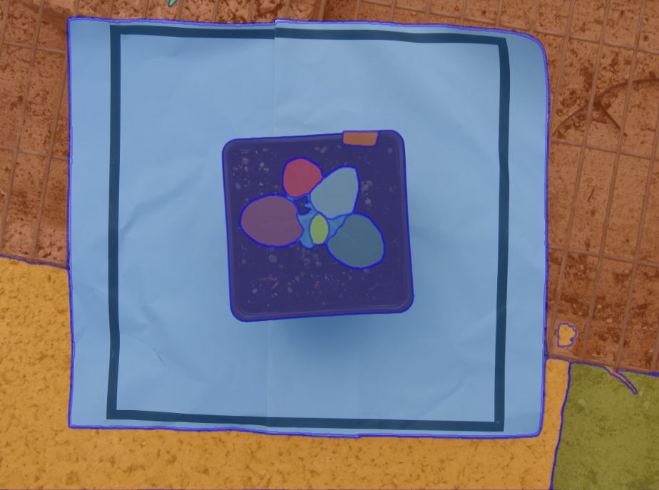

# Segment Anything Tutorial

This is an introductory tutorial to using Meta AI's Segment Anything tool for easy image segmentation.

## About Image Segmentation

Working with images is hard. Images compress the three dimensional world into a set of coloured points in two dimensions. When we look at the world, our visual cortex processes the images we see and makes a huge number of calculations, very quickly and subconsciously. Without realising it, we split a scene into objects, making estimations about size, texture, motion, correcting colours based on the ambient light, and mapping them onto memorised concepts learned from objects we've seen before. 

This process – detecting the objects and their component parts in a scene - is known as image segmentation. Image segmentation means going from this...:

...to this:

 and training computers to do it has historically been very challenging. Image processing algorithms for segmentation rely on clustering similar sets of pixels, or detecting edges uses changes in shade or colour. More modern deep-learning approaches use neural networks to identify complex, high-dimensional patterns. Usually these models are trained with examples of the kind of object they are required to detect. 

## Segment Anything Model (SAM and SAM2)

Segment Anything is a project from [Meta AI](https://ai.meta.com/). They describe it as a foundational model for image segmentation - that is, it's been pre-trained to perform the task of image segmentation in a generalised way. It has three steps:

1. The _image encoder_ takes an image and converts it to an embedding representing the structural relationships in the image
2. The _prompt encoder_ takes a prompt from the user, in the form of one or more locations in the image, and encodes its position so that it can be compared to the image embedding
3. The _mask decoder_ takes the embedding of the image and the encoded prompt and returns a set of masks indicating regions of the image containing relevant segments

### Image encoder

The main job of the image encoder is to take an image and generate a numerical representation of the complex features that the image contains. This process is somewhat abstract, but roughly, it works by dividing the image into patches of 16x16 pixels, then mapping these patches to a new coordinate system, where proximate locations indicate that the patches contain similar features. This mapping of the original image, in 1024x1024 RGB pixels, to a new structure with the shape 64x64x256, is called an embedding. The image encoder also encodes the absolute position of every patch in the image, which allows SAM to compare the locations of prompts to locations in the embedding.

The image encoder is pre-trained on images with patches randomly removed, and taught to reconstruct the missing patches. This creates a general understanding of the concept of an object. Then a secondary training process uses images paired with sets of masks representing segments, so the model can learn to produce the kind of output needed in image segmentation. 

### Prompt encoder

The prompt encoder allows the user to select positions in the image, and it encodes those positions so that they can be compared to the embedded image patches. Prompts can be take several forms:

- one or more points to include in a segment (foreground points)
- one or more points to exclude from a segment (background points)
- a bounding box
- a mask (you can think of this as a pre-defined guess at a segment that SAM will try to refine)

This allows for flexible interactions with the model. 

### Mask decoder

The mask decoder takes the image embedding and the encoded prompt and produces a set of possible masks. There is inherent ambiguity in segmentation - for example, a shirt could be considered an object in its own right, or it might be part of the outline of the person wearing it. SAM is designed is designed to output multiple valid masks, along with an evaluation of how well they match the prompt and the structures contained in the image.